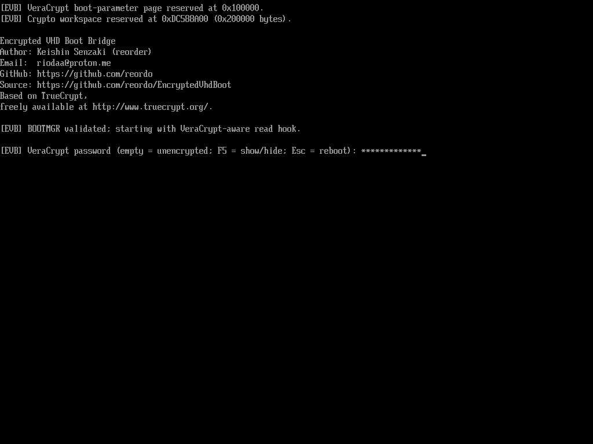
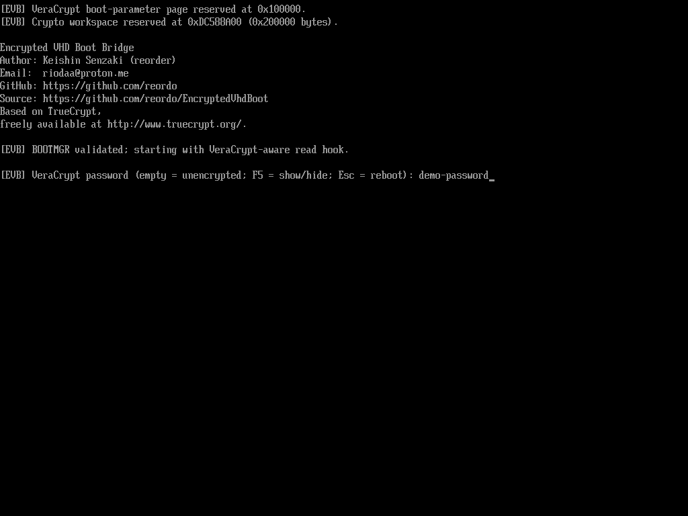
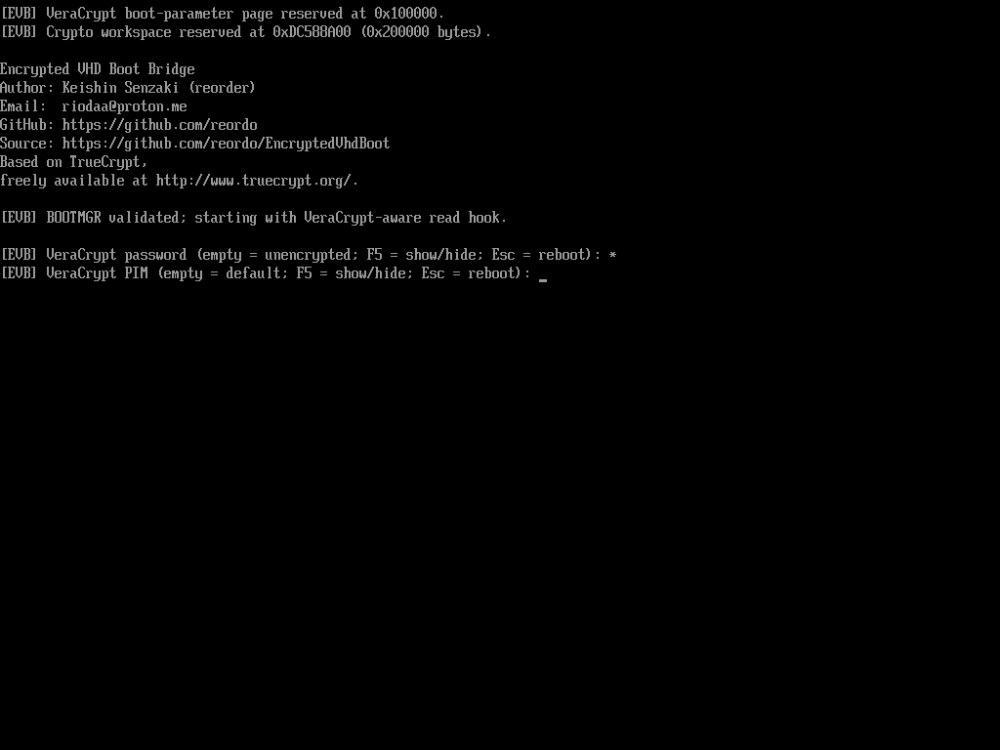
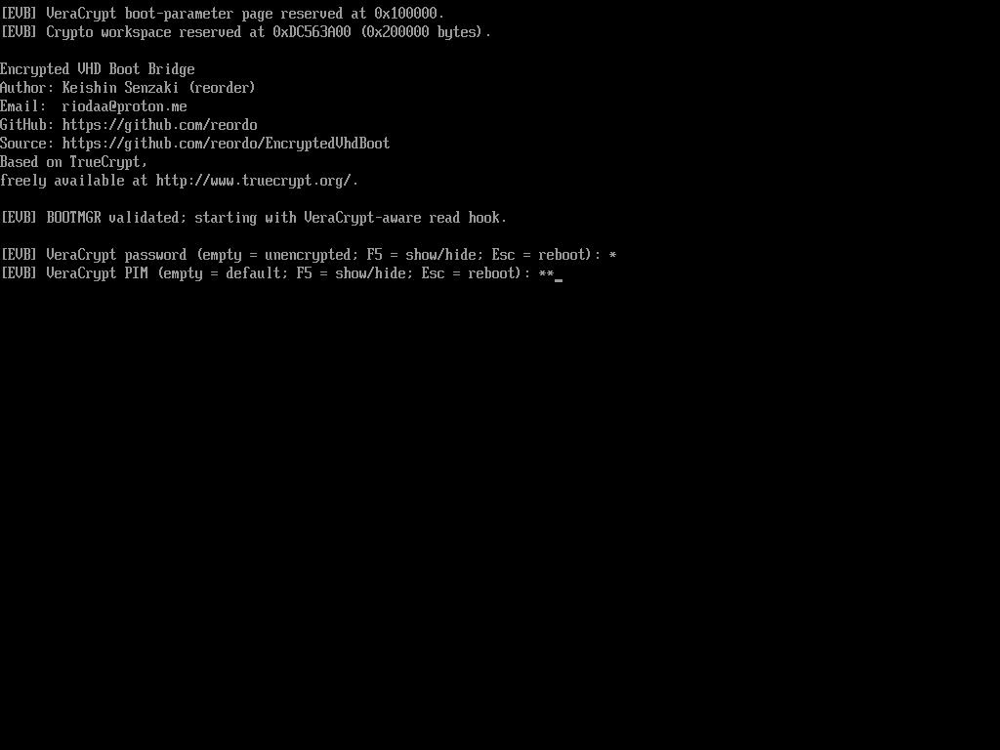

# Encrypted VHD Boot Bridge

An x64 UEFI compatibility bridge for booting VeraCrypt system-encrypted
Windows VHDs through Ventoy's native Windows VHD boot path.

The bridge runs before Windows Boot Manager, authenticates the encrypted system
volume, decrypts early VHD reads, rejects pre-kernel writes, and passes
VeraCrypt boot parameters to the Windows driver. Unencrypted VHDs remain
bootable through the same image.

## Compatibility

The current release targets:

- x64 UEFI with Secure Boot disabled;
- Ventoy `ventoy_vhdboot.img` Win10Based v3.0;
- Windows Boot Manager `10.0.10240.16384` from that image;
- Windows 10 and Windows 11 x64 `winload.efi` with the structurally recognized
  VHD1 parser;
- fixed and dynamic VHD1 system disks;
- default or custom VeraCrypt system PIM.

End-to-end system encryption and driver handoff were tested with
[VeraCrypt 1.26.29](https://github.com/veracrypt/VeraCrypt/releases/tag/VeraCrypt_1.26.29).
Other VeraCrypt versions are not blocked by an explicit version allowlist, but
are not currently claimed as tested.

The VeraCrypt version above is the version installed in the tested Windows
systems. The bridge itself is built from the separately pinned source revisions
listed in [SOURCE.txt](SOURCE.txt); those revisions are newer than the exact
`VeraCrypt_1.26.29` release tags.

VHDX and differencing VHDs, other Boot Manager versions, Legacy BIOS, Secure
Boot, hidden systems, and rescue workflows are not yet supported.

The current compatibility matrix is:

| Windows release | Winload file version | VeraCrypt result |
| --- | --- | --- |
| Windows 10 Enterprise LTSC 2019 x64 | 10.0.17763.292 | Booted to desktop, EA 15 / PRF 4 |
| Windows 10 1909 Pro x64 | 10.0.18362.1593 | Booted to desktop, EA 14 / PRF 2 |
| Windows 10 21H2 Pro x64 | 10.0.19041.3086 | Booted to desktop, EA 1 / PRF 5 |
| Windows 10 22H2 Pro x64 | 10.0.19041.6456 | Booted to desktop with default PIM and PIM 67 |
| Windows 10 22H2 Pro x64, unencrypted | 10.0.19041.6456 | Empty-password path booted to desktop |
| Windows 11 25H2 Pro x64 | 10.0.26100.8655 | Booted to desktop after full BitLocker removal and VeraCrypt system encryption |

Fixed VHD1 was also boot-tested with Windows 10 22H2 Pro x64. These results are
evidence, not a version allowlist. An unlisted Windows 10 or Windows 11 x64
build is attempted when its loaded image contains one unambiguous VHD1 parser
matching the validated structure.

## Requirements

- Windows x64 build host;
- Git and Python 3.10 or later;
- Visual Studio 2022 Build Tools with the MSVC x86/x64 toolchain;
- NASM available in `PATH` or through `NASM_PREFIX`;
- the official Ventoy Win10Based v3.0 `ventoy_vhdboot.img` from
  [ventoy/vhdiso releases](https://github.com/ventoy/vhdiso/releases/tag/v3.0).

Use a short checkout or extraction path, such as `C:\src\EncryptedVhdBoot`.
EDK II and the MSVC host tools can exceed Windows command-line or path limits
when the source tree is nested deeply.

The supported source image has SHA-256:

```text
6161d63520eb72bd1d5cb99aa9a771cc8b93ad9718de637b7d2195911dd224ef
```

## Build

Clone the repository with its pinned dependencies and initialize the Python
environment:

```powershell
git clone https://github.com/reordo/EncryptedVhdBoot.git
Set-Location EncryptedVhdBoot
tools\Initialize-Repository.ps1
```

Build the UEFI application and assemble a new vhdboot image from the official
upstream image:

```powershell
tools\Build-Preloader.cmd
tools\Build-VhdBootImage.ps1 -SourceImage .\ventoy_vhdboot.img
```

The outputs are written to:

```text
artifacts/EncryptedVhdBoot.efi
artifacts/ventoy_vhdboot_encrypted.img
```

The build uses fixed metadata timestamps and removes PE debug metadata, so the
release executable contains no local build paths. Repeated builds from the same
path, pinned inputs, and toolchain are byte-identical. Different checkout-path
lengths can change PE section-size padding metadata without changing the code
or section contents. The image builder verifies the upstream SHA-256,
reconstructs the ISO, embeds the project notices and license texts under
`/EVB`, and does not modify the source image.

To create a release source archive that includes the exact contents of all
required Git submodules, run:

```powershell
tools\New-SourceArchive.ps1 -Version 1.0.0
```

GitHub's automatically generated source archives contain only the submodule
links. The archive produced by this script is the complete, self-contained
source input for the project code and its pinned dependencies.

## Install and restore

Keep an independent backup of the original image. The installer also creates a
read-only `ventoy_vhdboot.original.img` next to the target after verifying its
hash.

```powershell
tools\Install-VhdBootImage.ps1 `
    -TargetImage V:\ventoy\ventoy_vhdboot.img `
    -WhatIf

tools\Install-VhdBootImage.ps1 `
    -TargetImage V:\ventoy\ventoy_vhdboot.img
```

Restore the verified original image with:

```powershell
tools\Restore-VhdBootImage.ps1 `
    -TargetImage V:\ventoy\ventoy_vhdboot.img
```

Replace `V:` with the Ventoy data-partition drive letter.

## Prepare a system-encrypted VHD

VeraCrypt does not offer system encryption in the tested configuration while
Windows is already running through native VHD boot. Prepare and encrypt the
system in a virtual machine instead. The verified workflow uses Oracle
VirtualBox:

1. Create an x64 UEFI virtual machine with a fixed or dynamic VHD (VHD1) as its
   system disk. Do not use VirtualBox snapshots or a differencing disk.
2. Install Windows 10 or Windows 11 x64 in the virtual machine and complete its
   normal setup.
3. On Windows 11, open an elevated Command Prompt and fully remove BitLocker or
   automatic device encryption before installing VeraCrypt:

   ```cmd
   manage-bde -off C:
   manage-bde -status C:
   ```

   Wait until the status reports `Conversion Status: Fully Decrypted` and
   `Percentage Encrypted: 0.0%`. `Protection Status: Protection Off` alone is
   not sufficient.
4. Install VeraCrypt 1.26.29 in the virtual Windows system, open **System >
   Encrypt System Partition/Drive**, and choose normal encryption of the
   Windows system partition. Hidden-system workflows are not supported by this
   project.
5. Complete VeraCrypt's pretest and encryption inside the virtual machine.
   Reboot there and confirm that the password and, when configured, PIM unlock
   the system successfully.
6. Fully shut down the virtual machine before copying or moving its VHD. Keep a
   separate backup. Preserve the complete VirtualBox machine folder as well if
   the same installation must remain bootable in VirtualBox.
7. Copy the VHD anywhere on the Ventoy data partition. Install this project's
   image as `/ventoy/ventoy_vhdboot.img` on that same partition.
8. Boot Ventoy in x64 UEFI mode with Secure Boot disabled and select the VHD.
   The bridge asks for the VeraCrypt password and then the PIM. Leave the PIM
   empty when the system uses VeraCrypt's default PIM value `0`.

Once encrypted in the virtual machine, the same VHD can be started through
this bridge on physical hardware and can still be attached to its VirtualBox
machine. Never run or modify the same VHD from both environments at once.

## Boot controls

- Empty password: continue through the original unencrypted-VHD path.
- Non-empty password: request the VeraCrypt system PIM.
- Empty PIM: use the standard system PIM value `0`.
- `F5`: toggle masked or visible password/PIM input.
- `Esc`: clear entered secrets and cold-reboot to the firmware boot sequence.

## Screenshots

These captures are from an x64 UEFI boot through a physical Ventoy drive. The
visible field contains demonstration text; real test credentials remain masked.

| Masked password | Visible password after `F5` |
| --- | --- |
|  |  |

| Password collapsed before PIM input | Masked custom PIM |
| --- | --- |
|  |  |

## Design

The UEFI application loads the original Windows Boot Manager from the image,
validates its binary profile, and replaces the in-memory VHD1 read/write
callbacks used by Boot Manager and Winload. Winload's parser is located by a
unique structural match within its PE sections instead of a version allowlist.
VeraCrypt-compatible volume code decrypts reads and rejects writes until
`veracrypt.sys` takes over after kernel startup. The VHD and Microsoft boot
files are not modified.

See [docs/architecture.md](docs/architecture.md) for the verified offsets,
handoff, and implementation details.

## Safety

This is experimental, security-sensitive pre-boot software. It has been tested
on the systems listed above, but has not received an independent security audit.
Do not treat compatibility testing as a cryptographic or implementation audit.

Test with recoverable VHD copies and maintain current backups. While VeraCrypt
is active, Boot Manager and Winload VHD writes fail closed as write-protected;
the empty-password path retains the original unencrypted write behavior.
Normal runtime writes are handled by the Windows VeraCrypt driver.

At `ExitBootServices`, the bridge wipes its private expanded-key workspace and
partial-sector buffer. It retains only the standard VeraCrypt handoff block
that `veracrypt.sys` still needs and later validates, consumes, and burns.
Native Windows VHD boot disables hibernation in the supported configuration.

The current EFI application and release image are not signed for Secure Boot,
and the supported configuration requires Secure Boot to be disabled. Verify a
downloaded release against its published SHA-256 before installing it. Security
issues may be reported as described in [SECURITY.md](SECURITY.md).

## Licensing and trademarks

Original project code is licensed under BSD-2-Clause-Patent. The built EFI
application also contains components governed by the VeraCrypt, TrueCrypt,
Apache 2.0, LGPL-3.0, GPL-3.0, and component-specific terms described in
[NOTICE](NOTICE) and [LICENSES](LICENSES/).

The prebuilt release image is derived from Ventoy's GPL-3.0-licensed
[`ventoy/vhdiso`](https://github.com/ventoy/vhdiso) Win10Based v3.0 image. As
documented by Ventoy, that upstream image also contains non-open-source
Microsoft boot files extracted from a Windows ISO. The Git source tree does not
contain that image or those Microsoft files; a source build requires the
official upstream image as an external input. The prebuilt image is distributed
separately for parity with the upstream `vhdiso` release model and remains
subject to all applicable third-party terms. See [NOTICE](NOTICE) and
[SOURCE.txt](SOURCE.txt) for exact provenance.

This project is independent and is not affiliated with or endorsed by Ventoy,
VeraCrypt, TrueCrypt, or Microsoft.

## Author

Keishin Senzaki (`reorder`)<br>
[riodaa@proton.me](mailto:riodaa@proton.me)<br>
[github.com/reordo](https://github.com/reordo)
